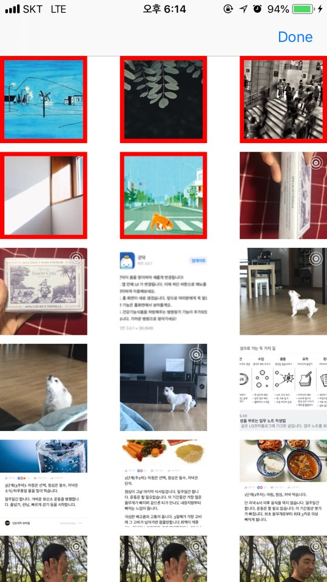
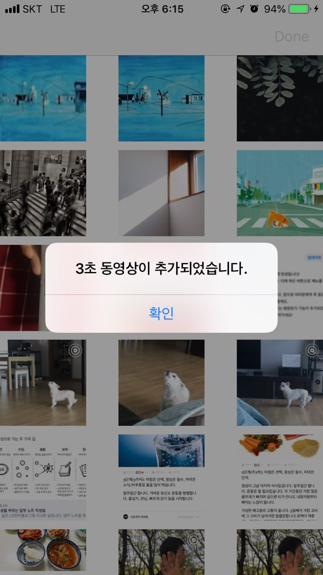
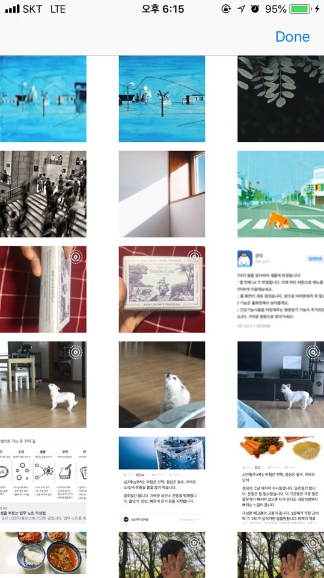
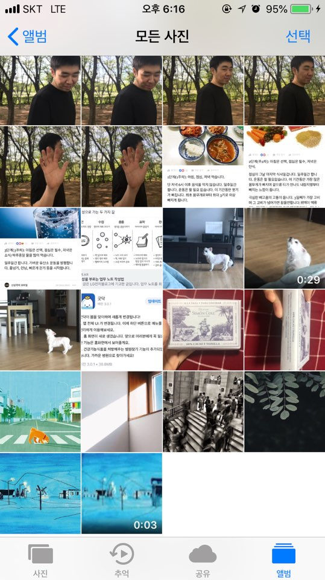

# Photo App

## CollectionView 생성
</img>

### CollectionView를 화면에 꽉 채우고, 40개 cell을 랜덤 색상으로 채움
- 시뮬레이터: iPhone 8

### 랜덤 색상 적용 시
- `drand48()` : 0~1 사이 범위 내에서 랜덤 숫자 생성
- UIColor.init()의 RGB 값은 0~1 사이 값을 가지므로, 보통 색상 지정 시 실제 RGB 값을 255로 나눔.
- 랜덤 색상 적용 시에는 0~1 사이의 랜덤 수를 생성하면 되므로, drand48()을 사용함

```swift
static var random: UIColor {
	return UIColor.init(red: CGFloat(drand48()), green: CGFloat(drand48()), blue: CGFloat(drand48()), alpha: 1)
}
```

### 학습 내용
>- **[Collection View 프로그래밍 방식]()**
>- **[Collection View와 TableView와 공통점 및 차이점](https://github.com/undervineg/swift-photoapp/blob/photo-step3/md/CollectionView_and_TableView.md)**

2018-04-13 (작업시간: 1일)

<br/>

## Photo 라이브러리 생성
</img>

### CollectionView 셀 크기 조정
#### 컬렉션뷰 셀 크기 변경 (100x100)
- [StoryBoard] 컬렉션 뷰의 셀 크기를 설정할 때는, 레이아웃의 ItemSize에 따라서 달라진다는 사실을 주의한다.
- [Code] UICollectionViewDelegateFlowLayout를 채택한 후, 해당 메소드를 구현 (기본적으로 UICollectionViewDelegate, UICollectionViewDataSource 채택해야)

```swift
func collectionView(_ collectionView: UICollectionView, layout collectionViewLayout: UICollectionViewLayout, sizeForItemAt indexPath: IndexPath) -> CGSize {
    return CGSize(width: ViewConfig.itemWidth, height: ViewConfig.itemHeight)
}
```

#### Cell에 ImageView 추가 (100x100)
- PhotoCell 커스텀 클래스 생성
- UIImageView를 추가하여 제약사항 설정
	- Frame: PhotoCell에 꽉 차도록 설정
	- ContentMode: 꽉 채워 보여주기 위해 scaleToFill로 설정

```swift
class PhotoCell: UICollectionViewCell, Reusable {
    @IBOutlet weak var photoImageView: UIImageView! {
        didSet {
            photoImageView.translatesAutoresizingMaskIntoConstraints = false
            photoImageView.leadingAnchor.constraint(equalTo: self.leadingAnchor).isActive = true
            photoImageView.trailingAnchor.constraint(equalTo: self.trailingAnchor).isActive = true
            photoImageView.topAnchor.constraint(equalTo: self.topAnchor).isActive = true
            photoImageView.bottomAnchor.constraint(equalTo: self.bottomAnchor).isActive = true
            photoImageView.contentMode = .scaleAspectFill
        }
    }
}
```

### 사진보관함에 있는 사진 이미지를 Cell에 표시
#### Photos 라이브러리 사용하여 사진보관함의 사진 불러오기
- 불러온 사진 데이터를 관리하는 Photos 클래스 작성 및 내부 사진들을 클래스 이름으로 접근하기 위해 Sequence를 채택
- PHAsset의 fetchAssets()를 통해 사진보관함의 사진들을 PHFetchResult<PHAsset> 형태로 불러옴
- option: 생성일(creationDate) 기준 내림차순(descending). 즉, 최신순으로 정렬

```swift
class Photos {
    private(set) var photoAssets = PHFetchResult<PHAsset>()
    ...
    private func fetchAllPhotosFromLibrary() -> PHFetchResult<PHAsset> {
        let options = PHFetchOptions()
        options.sortDescriptors = [NSSortDescriptor.init(key: "creationDate", ascending: false)]
        return PHAsset.fetchAssets(with: options)
    }
    ...
}
```

#### PHCachingImageManager 클래스 사용하여 Cell에 이미지 표시
- CollectionView의 특정 셀에 이미지를 표시하기 위해, 다운받은 photos 중 cell 위치와 동일한 PHAsset 데이터를 UIImage로 파싱하여 넘기는 함수 구현
- PHCachingImageManager의 requestImage() 사용
- 타깃 사이즈는 imageView 사이즈와 동일
- contentMode는 PHImageContentMode 타입으로, 이미지를 자르는 모드이다. aspectFill로 설정하여 이미지뷰를 꽉 채울 수 있는 크기로 자를 수 있도록 함
- 탈출 클로저를 파라미터에 정의하여 image를 메소드 호출 부분에서 처리하도록 함

```swift
private let imageManager: PHCachingImageManager
...
func requestImage(at index: Int, _ completion: @escaping (UIImage?) -> (Void)) {
        imageManager.requestImage(for: photos.at(index),
                                  targetSize: CGSize(width: ViewConfig.itemWidth, height: ViewConfig.itemHeight),
                                  contentMode: PHImageContentMode.aspectFill,
                                  options: nil) { image, _ in completion(image) }
}
```

- 메소드 호출 부분 (ViewController)

```swift
func collectionView(_ collectionView: UICollectionView, cellForItemAt indexPath: IndexPath) -> UICollectionViewCell {
    let cell = collectionView.dequeueReusableCell(withReuseIdentifier: PhotoCell.id, for: indexPath) as! PhotoCell
    photoService.requestImage(at: indexPath.item) { image in
        cell.photoImageView.image = image
    }
	return cell
}
```

#### PHPhotoLibrary 클래스 사용하여 사진보관함 변경 여부를 관찰
- Photos 데이터를 다루는 PhotoService 클래스를 정의: Photos는 자료구조로만 사용하기 위함
- PHPhotoLibraryChangeObserver를 채택하여 `PHPhotoLibrary.shared().register(self)`로 옵저버를 등록하면 사진보관함의 변경 여부를 알 수 있음
- PHPhotoLibraryChangeObserver의 photoLibraryDidChange() 메소드를 구현하여 사진보관함 변경 시 처리할 로직 추가: 변경사항으로 Photos를 업데이트하고, VC에 노티를 보내어 뷰를 변경할 수 있도록 함

```swift
func photoLibraryDidChange(_ changeInstance: PHChange) {
    guard let changes = changeInstance.changeDetails(for: self.photos.photoAssets) else { return }
    self.photos.updateAssets(with: changes.fetchResultAfterChanges)
    NotificationCenter.default.post(name: .photoLibraryChanged, object: nil,
                                    userInfo: [NotificationKeys.photoChanges: changes])
}
```

- VC에서 변경사항을 받아 뷰 업데이트: changes가 큰 변화인 경우, 전체 컬렉션뷰 데이터를 재로드. 점진적인 변경사항이라면, 해당 부분만 업데이트.

```swift
@objc func updateCollectionView(notification: Notification) {
    guard let userInfo = notification.userInfo,
        let changes = userInfo[NotificationKeys.photoChanges] as? PHFetchResultChangeDetails<PHAsset> else { return }
    DispatchQueue.main.async {
        changes.hasIncrementalChanges ? self.updateChangedItems(changes) : self.collectionView.reloadData()
    }
}
```

- 점진적인 변경사항인 경우: 변경된 인덱스들만 배치 업데이트. 앱이 running 중에 사진첩에 변화가 생기면 바로 반영된다.
- 이 때, **IndexPath.init(index:)를 사용하면 런타임 에러가 발생한다. 따라서 꼭 section을 지정할 수 있는 IndexPath.init(row:section:) 메소드를 사용한다.**

```swift
private func updateChangedItems(_ changes: PHFetchResultChangeDetails<PHAsset>) {
    self.collectionView.performBatchUpdates({
        if let insertedIndexes = changes.insertedIndexes, insertedIndexes.count > 0 {
            self.collectionView.insertItems(at: insertedIndexes.compactMap { IndexPath(row: $0, section: 0) })
        }
        if let deletedIndexes = changes.removedIndexes, deletedIndexes.count > 0 {
            self.collectionView.deleteItems(at: deletedIndexes.compactMap { IndexPath(row: $0, section: 0) })
        }
        if let changedIndexes = changes.changedIndexes, changedIndexes.count > 0 {
            self.collectionView.reloadItems(at: changedIndexes.compactMap { IndexPath(row: $0, section: 0) })
        }
        if changes.hasMoves {
            changes.enumerateMoves {
                self.collectionView.moveItem(at: IndexPath(row: $0, section: 0), to: IndexPath(row: $1, section: 0))
            }
        }
    })
}
```

### 학습 내용
>- **[Photos 라이브러리의 구성](https://github.com/undervineg/swift-photoapp/blob/photo-step3/md/Photos_FrameWork.md)**
>- **[PHImageContentMode와 UIImageView의 ContentMode의 차이](https://github.com/undervineg/swift-photoapp/blob/photo-step3/md/PHImageContentMode_ContentMode.md)**

2018-04-17 (작업시간: 1일)

<br/>

## 이미지 여러 장으로 3초짜리 동영상 만들기
</img>
</img>
</img>
</img>

### 라이브 포토 아이콘 표시
- 라이브포토 이미지를 표시할 UIImageView 요소를 cell에 추가
- 오토레이아웃은 코드로 추가: 셀의 우상단에 1/4 크기로 붙임

```swift
@IBOutlet weak var liveBadgeImageView: UIImageView! {
    didSet {
        liveBadgeImageView.translatesAutoresizingMaskIntoConstraints = false
        liveBadgeImageView.widthAnchor.constraint(equalTo: self.widthAnchor, multiplier: 0.25).isActive = true
        liveBadgeImageView.heightAnchor.constraint(equalTo: self.heightAnchor, multiplier: 0.25).isActive = true
        liveBadgeImageView.trailingAnchor.constraint(equalTo: self.trailingAnchor).isActive = true
        liveBadgeImageView.topAnchor.constraint(equalTo: self.topAnchor).isActive = true
    }
}
```

- asset의 mediaSubTypes 중 .photoLive 서브타입이 있는지 확인할 수 있는 프로퍼티 익스텐션 추가

```swift
extension PHAsset {
    var isLivePhoto: Bool {
        return self.mediaSubtypes.contains(.photoLive)
    }
}
```

- requestImage() 시, 라이브포토 여부도 클로저의 인자로 전달하여 컬렉션뷰 셀 표시 시 라이브포토인 경우 아이콘 표시
- 라이브포토 표시는 `PHLivePhotoView.livePhotoBadgeImage(options:)` 사용

```swift
func requestImage(at index: Int, _ completion: @escaping (UIImage?, Bool) -> (Void)) {
    imageManager.requestImage(for: photos.at(index),
                              targetSize: ViewConfig.itemSize,
                              contentMode: PHImageContentMode.aspectFill,
                              options: nil) { image, _ in completion(image, self.photos.at(index).isLivePhoto) }
}

func collectionView(_ collectionView: UICollectionView, cellForItemAt indexPath: IndexPath) -> UICollectionViewCell {
	...
	photoService.requestImage(at: indexPath.item) { image, isLivePhoto  in
	    cell.photoImageView.image = image
	    cell.liveBadgeImageView.image = isLivePhoto ? PHLivePhotoView.livePhotoBadgeImage(options: .overContent) : nil
	}
	...
}
```

### 셀 다중 선택 및 Done 버튼 활성화
#### 선택된 셀의 테두리를 빨간색으로 표시
- UICollectionViewCell를 상속받는 뷰에 isSelected를 오버라이드 하여 셀이 선택될 때는 빨간색, 선택 해제되면 무색으로 변경되도록 구현

```swift
override var isSelected: Bool {
    didSet {
        selectedBackgroundView?.layer.borderWidth = 5
        selectedBackgroundView?.layer.borderColor = isSelected ? UIColor.red.cgColor : UIColor.clear.cgColor
    }
}
```

- 테두리는 selectedBackgroundView 프로퍼티에 적용하는데, selectedBackgroundView는 cell에 이미 붙어있는 상태는 아니기 때문에 새 UIView로 초기화 한 후, 현재 cell에 붙여줘야 한다.

```swift
override func awakeFromNib() {
    super.awakeFromNib()
    selectedBackgroundView = UIView.init(frame: self.bounds)
    self.addSubview(selectedBackgroundView!)
}
```

#### 셀 3개 이상 선택 시 Done 버튼 활성화
- 컬렉션뷰의 `allowsMultipleSelection`를 true로 설정하여 여러 셀을 선택할 수 있도록 한다.
- Done 버튼의 `isEnabled`를 사용하여 활성화/비활성화를 설정한다.

#### Done 버튼 클릭 시, 3초 길이 비디오로 만들어 사진보관함에 저장
- 선택된 사진들의 PHAsset 배열을 UIImage로 변환한 후, AVAssetWriter를 사용
- [문제봉착!] 이미지 변환 시, 해상도 문제
	- 착각: PHImageContentMode를 .aspectFit으로 지정하면 targetSize에 맞게 이미지가 맞춰 들어갈 것이라고 생각 -> 이미지가 큰 경우 targetSize에 맞춰 crop됨...
	- 시도 1: fullSize 이미지를 받아서 사이즈를 targetSize 비율에 맞춰 변경
		- 배열로 넘어온 assets를 비동기로 받기 위해 DispatchGroup을 사용. 모든 assets를 image로 변경하고나면 global 큐에서 비디오를 생성하도록 구현

	```swift
	func requestImages(from assets: [PHAsset], targetSize: CGSize, _ completion: @escaping ([UIImage?]) -> (Void)) {
	    var downloadedImages: [UIImage?] = []
	    let myGroup = DispatchGroup()
	    assets.forEach { asset in
	        myGroup.enter()
	        self.imageManager.requestImageData(for: asset, options: nil, resultHandler: { (data, _, _, _) in
	            if let data = data, let fullImage = UIImage(data: data) {
	                let resizedImage = fullImage.resizedImage(fullImage.size.newSize(fitTo: targetSize))
	                downloadedImages.append(resizedImage)
	                myGroup.leave()
	            }
	        })
	    }
	    myGroup.notify(queue: .global()) {
	        completion(downloadedImages)
	    }
	}
	```
	- 시도 2: PHImageRequestOption의 resizeMode를 .exact로 설정해야 targetSize에 딱 맞춰서 이미지 생성 가능. 또, deliveryMode를 설정해주지 않으면 에러 남

	```swift
	let options = PHImageRequestOptions()
    options.deliveryMode = .highQualityFormat
    options.resizeMode = .exact
	```

- AVAssetWriter는 startWriting, startSession, finishWriting 시 사용
- 실제로 미디어데이터를 쓰는 객체는 AVAssetWriterInput이다. (output 파일에 쓸 개별 track에 사용)
- AVAssetWriterInput 객체는 isReadyForMoreMediaData 프로퍼티가 true인 동안에만 쓸 수 있다.
- 비동기로 이미지를 받을 때는 isReadyForMoreMediaData가 특정 시점에 false가 되기 때문에 for문으로 배열의 원소를 접근하는 방식을 쓰면 누락되는 이미지가 있을 수 있다. 따라서 while 문을 사용하여 프레임 인덱스는 직접 증가시키는 방식을 사용
- AVAssetWriterInput 객체는 CMSampleBuffer 타입으로 데이터를 받는데, 만약 CVPixelBuffer 객체를 붙이고 싶다면 AVAssetWriterInputPixelBufferAdapter 클래스를 사용해야 한다.
- 이미지를 붙이는 작업이므로 CVPixelBuffer를 사용하였다.

```swift
var i = 0
self.writerInput.requestMediaDataWhenReady(on: mediaQueue) { [self = self] in
    while self.writerInput.isReadyForMoreMediaData {
        if i >= images.count {
            self.writerInput.markAsFinished()
            self.writer.finishWriting {
                completion(self.writer.outputURL)
            }
            break
        }

        if let image = images[i], let buffer = self.samplePixelBuffer(from: image) {
            if i == 0 {
                self.pixelBufferAdapter.append(buffer, withPresentationTime: kCMTimeZero)
            } else {
                let currPresentTime = CMTimeMultiply(frameTime, Int32(i))
                self.pixelBufferAdapter.append(buffer, withPresentationTime: currPresentTime)
            }
            i += 1
        }
    }
}
```

- 한 장의 이미지를 통해 한 개의 픽셀버퍼를 만들 때
- 비디오사이즈 위에 이미지 사이즈만큼 그리고, 세로 중앙정렬하였다.
- 세로중앙정렬 시, context의 origin은 좌상단이 아닌 좌하단에 위치하므로 주의해야 한다.

```swift
let pixelData = CVPixelBufferGetBaseAddress(resultBuffer!)
let context = CGContext(data: pixelData, width: videoWidth, height: videoHeight,
                        bitsPerComponent: 8, bytesPerRow: CVPixelBufferGetBytesPerRow(resultBuffer!),
                        space: CGColorSpaceCreateDeviceRGB(), bitmapInfo: CGImageAlphaInfo.noneSkipFirst.rawValue)
let yCenter = (videoHeight-image.height)/2
context?.draw(image, in: CGRect(x: 0, y: yCenter, width: image.width, height: image.height))
```

### 학습 내용
>- **[UICollectionView 셀의 구성]()**
>- **[AVFoundation 라이브러리의 구성]()**

2018-04-24 (작업시간: 2일)

<br/>


## 다운받은 이미지 저장하기 feat. GCD 작업 스케줄링
</img>
</img>
</img>
</img>

### 서버에서 받은 데이터 처리


### 셀 롱터치 시 메뉴 컨트롤러(Save) 표시


### Save한 이미지 저장 및 바로 업데이트 표시


### 학습 내용
>- **[동시성 프로그래밍]()**
>- **[메인쓰레드에서 처리해야 하는 동작]()**
>- **[GCD 이벤트 소스(Event Source)]()**
>- **[UIMenuController 동작 방식]()**

<br/>